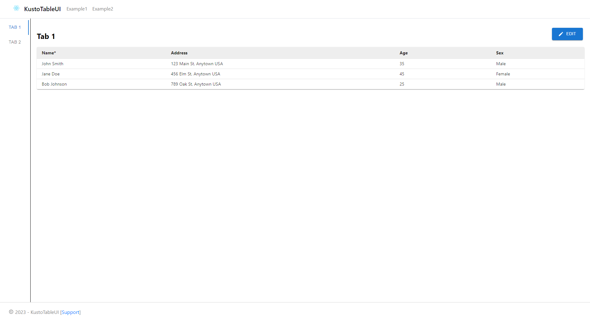

# Kusto Table UI

A component to render an editable table UI dynamically based on the schema and contents of a Kusto table.

## Getting started

There are no changes needed to run locally though you do need to have an app id that has access to the kusto cluster and database. Update the environment file with all required variables(clusterName, databaseName, clientId, tenantId). Note: Onload login window pops up to enter login credentials to connect to kusto cluster.

- Update config.json under src/pages to include tableFunction, tableName, column metadata, sorting order.

Here is an example of the page rendering table component based on the data returned from kusto function

## Available Scripts

In the project directory, you can run:

- npm start: Runs the project locally.
- npm test: Runs all test in the project.
- npm run build: Builds the project.

## Contributing

Issues, additional features, and tests are all welcome. See [CONTRIBUTING.md](CONTRIBUTING.md) for more information.

## Trademarks

This project may contain trademarks or logos for projects, products, or services. Authorized use of Microsoft
trademarks or logos is subject to and must follow
[Microsoft's Trademark & Brand Guidelines](https://www.microsoft.com/en-us/legal/intellectualproperty/trademarks/usage/general).
Use of Microsoft trademarks or logos in modified versions of this project must not cause confusion or imply Microsoft sponsorship.
Any use of third-party trademarks or logos are subject to those third-party's policies.
